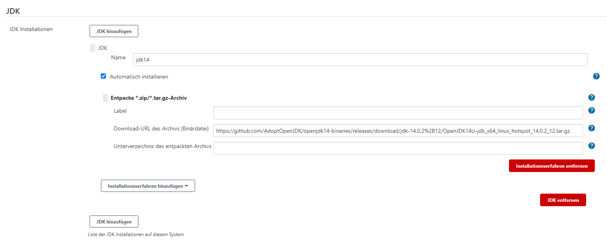
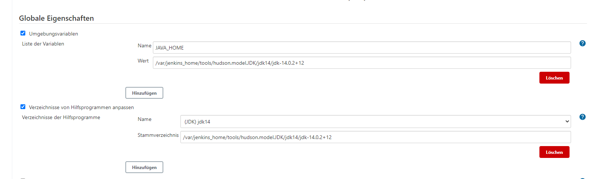

# Install Tools in Jenkins

## Maven

Just select install from apache

## JDK

### Install the jdk

Get the newest version from [AdoptOpenJDK](https://github.com/AdoptOpenJDK/openjdk14-binaries/releases/download). Use the Linux amd64 build.

### Set Paths and Variables for JDK in the global config

Warning: (Dont use jdk14 as a tool in the pipeline. This will overwrite the JAVA_HOME variable with an incorrect path)
